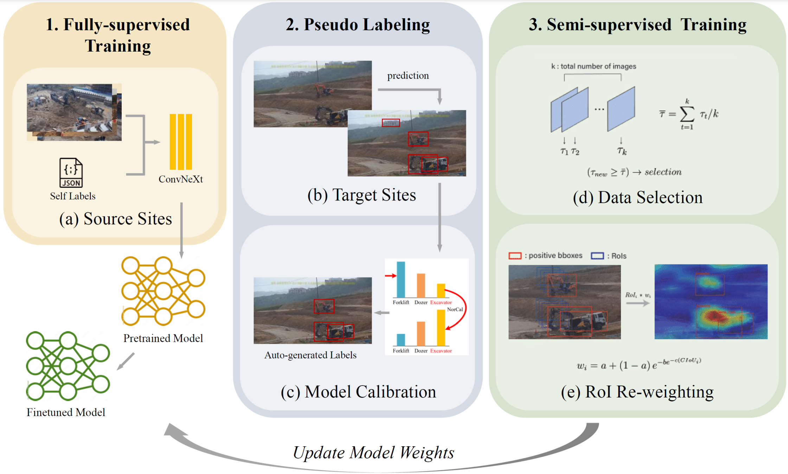

# Leveraging Semi-Supervised Learning for Domain Adaptation: Enhancing Safety at Construction Sites through Long-Tailed Object Detection
The implementation code of the paper _"Leveraging Semi-Supervised Learning for Domain Adaptation: Enhancing Safety at Construction Sites through Long-Tailed Object Detection"_.
## Proposed Approach


## Installation
Clone MMDetection v2.18 and install the required packages:
```https://github.com/open-mmlab/mmdetection.git```

## Training and Testing
To train the model, run the following command:
```sh train_semi_ours.sh```

To test the model and compare with baseline, run the following command:
```sh check_mAP.sh```

## Environment
The code is tested on the following environment:
- Ubuntu 20.04
- Python 3.8
- GPU: NVIDIA GeForce RTX 4090


